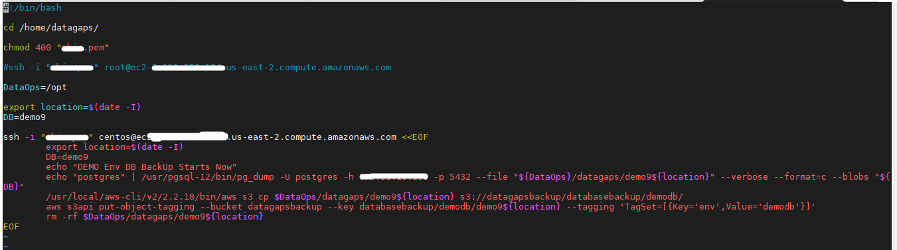

# Backup Env’s to S3 Bucket :

- First Created a Automation Script file with name backup-s3upload.sh for taking backup of Postgres DB to S3 bucket .
- Created a Jenkins node and Given required permissions for running backup-s3upload.sh from Jenkins job 
- Also made this Jenkins job schedule Run for EveryDay for taking DB backup to S3 Bucket.

### Screenshots For Evidence : 

- Screenshot from Jenkins job for Running backup-s3upload.sh Script file.

  

- Screenshot of Automation backup script present in backup-s3upload.sh file.

  

- Screenshot from Jenkins for Schedule backup of postgres Db to s3 bucket using Automation Script file. 

  

- Screenshot from Aws S3 bucket of taken backups using Jenkins Job.

  

## Restoring DB:
- If in can by chance present existing Postgres Db was tempered or corrupted We can Restore the Database from Backup database from which are stored in AWS S3 Bucket.

- For Restoring Existing postgres Backup Db need to create a New Empty Repository by logging to Postgres .

  

- Copy the Taken backup file to location and Now Restore the existing postgres backup Db to newly created empty Repository.

- Restore command for Db 

  - Switch to "postgres" user (su - postgres) and execute the below command.
  - pg\_restore -U <username> -h <host> -p <port> --dbname "<Databasename>" --verbose "<Path to backup file>"

    - replace username , host name, port number, DB name and path\_of\_backupfile with actual names.
    - Ex: pg\_restore -U postgres -h localhost -p 5432 --dbname "dataflow" --verbose "/tmp/demo" 

- ` `Sample Screenshot of Restoring:

  

- After successful Restore you may see in this way.

  

- Restoring Database is Successful now.!

